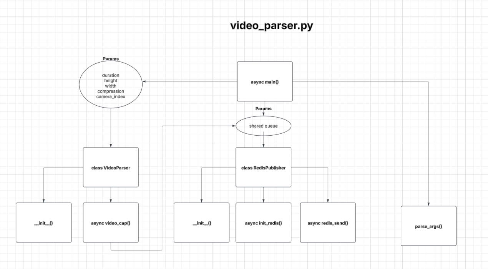
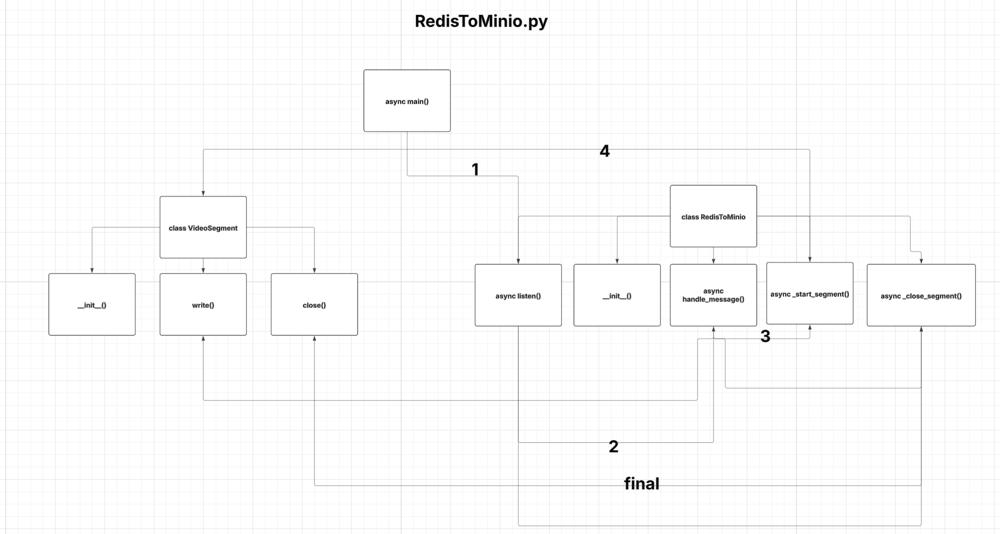

# RedisToMinio

Ingest real-time camera frames via Redis Streams, assemble MP4 segments with OpenCV, and upload completed videos to MinIO. Lightweight, asynchronous, and end-to-end practical.

## Why
- Archive camera footage in fast, safe, manageable chunks
- Stream from edge devices to Cloud/On‑prem MinIO/S3 storage
- Flexible quality, resolution, and segmentation (idle timeout)

## Features
- Asynchronous Redis Streams consumption (`XREAD`) and production (`XADD`)
- JPEG compression to optimize bandwidth
- Auto re-open OpenCV VideoWriter on dynamic resolution changes
- Progress bar (tqdm) with total frame estimation
- Upload MP4 to MinIO with object metadata (camera, timestamp, duration)
- Auto-cleanup local files after upload

## Architecture
- `video_parser.py`: Captures frames from camera, optionally resizes, JPEG-encodes, and writes to Redis Stream.
- `RedisToMinio.py`: Reads frames from Redis, assembles MP4 segments, closes on idle/sequence break, then uploads to MinIO.

## Quickstart

1) Dependencies

```bash
python -m venv .venv && source .venv/bin/activate  # Windows: .venv\Scripts\activate
pip install --upgrade pip
pip install -r requirements.txt
```

2) MinIO (local quick start – optional but recommended)

```bash
docker run -p 9000:9000 -p 9001:9001 \
  -e MINIO_ROOT_USER=admin -e MINIO_ROOT_PASSWORD=changeme \
  -v $(pwd)/minio-data:/data \
  quay.io/minio/minio server /data --console-address ":9001"
# MinIO API: http://localhost:9000, Console: http://localhost:9001
```

3) Environment (.env)

```bash
cp .env.example .env
# Adjust values for your environment.
```

4) Producer (camera → Redis)

```bash
python video_parser.py -d 15 -ci 0 -he 720 -w 1280 -c 80
```

5) Consumer (Redis → MP4 → MinIO)

```bash
python RedisToMinio.py
```

Generated MP4 files are kept temporarily under `output_videos/`; they are removed locally after being uploaded to MinIO.

## Configuration
Both scripts are configured via environment variables. Adjust to your setup (e.g., local Redis or Redis Cloud, local MinIO or remote S3-compatible server).

- `video_parser.py` Redis connection and stream name
- `RedisToMinio.py` Redis and MinIO credentials, `IDLE_TIMEOUT`, `VIDEO_OUTPUT_DIR`

Note: Example values are for development only. Use your own credentials and strong secrets.

## Segmentation Logic
- A new segment starts initially or on sequence breaks.
- If no frames arrive for 4s (`IDLE_TIMEOUT`), the current segment is closed and uploaded.
- File name: `cam{camera}_{ISO-datetime}.mp4`, metadata: `{camera_id, timestamp, duration}`

## Flow Diagrams





## Notes
- `redis` 4.x+ provides `redis.asyncio`.
- OpenCV `VideoWriter` codec: `mp4v`. You may need FFmpeg/codec support on your platform.
- For remote Redis/MinIO setups, ensure proper network/security/cert configuration.

—
Clean, simple, and effective: the easiest path from camera to MinIO.
